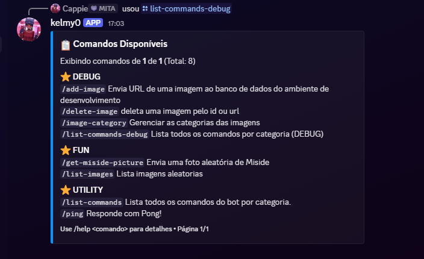

# 🤖 kelmy0_bot




> A Discord bot developed for **learning purposes** and as part of a **portfolio showcase**.

## 📋 Project Status

- **Active Development**: [`develop`](https://github.com/kelmy0/kelmy0_bot/tree/develop) branch
- **Stable Releases**: [`main`](https://github.com/kelmy0/kelmy0_bot/tree/main) branch

Currently focused on implementing **more commands**, with additional features planned for future releases.

## 🛣️ Roadmap

The project is still under development; the first stable release is not yet available.

- [x] Core command system
- [x] Database integration with Prisma
- [ ] Commands
- [ ] Web dashboard for bot management
- [ ] Official documentation site

## 💻 Requirements

Before starting, make sure you meet the following requirements:

- You have installed Node.js v24 or higher
- You are on Windows (not yet tested on Linux or Mac)
- You are using one of the following databases: Microsoft SQL Server, PostgreSQL, or MongoDB (more databases will be supported in the future)

## 🚀 Installing `<kelmy0_bot>`

To install kelmy0_bot, follow these steps.

Windows:

```
git clone https://github.com/kelmy0/kelmy0_bot.git
cd kelmy0_bot
npm install
```

Linux: coming soon!

## ☕ How to use kelmy0_bot

To use kelmy0_bot, follow theses steps:

1 - Create a bot on Discord by clicking [here](https://discord.com/developers/applications).

2 - Configure the `.env` file with your credentials.

3 - Run the following commands.

```
npm run prisma:deploy
npm run commands:deploy
```

4 - Finally, run this command.

```
npm run dev
```

After completing these steps, your bot will be online and ready to use.

## 🌐 Website

A dedicated website for the bot is currently under development.
Stay tuned for updates — Coming Soon

## 👨‍💻 Author

This project was created by me.

<table>
  <tr>
    <td align="center">
      <a href="https://github.com/kelmy0" title="author github profile">
        <br>
        <sub>
          <b>Riquelme Pantoja</b>
        </sub>
      </a>
    </td>
  </tr>
</table>

## 📝 License

This project uses the MIT license. More info [here](https://opensource.org/license/mit).
